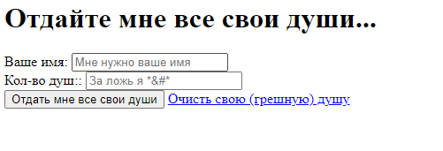
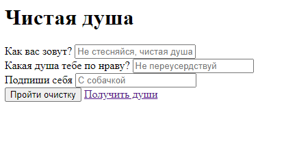
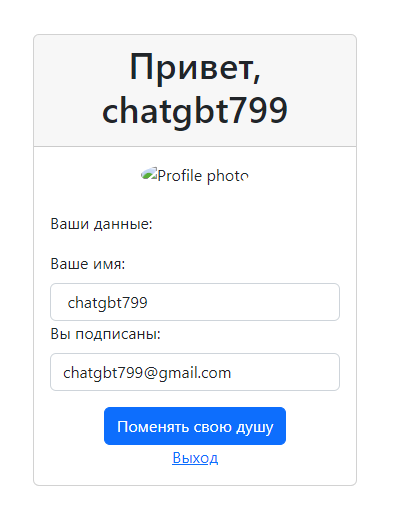

# DevilAuto
авторизация и регистрация с очень интересным оформлением, где у вас забирают души хехехе

Можно еще очиститься и взять себе новые души или пометить свою старую
#
Проект состоит ровным счетом из ничего и докера, там пару страничек и рабочий функционал
#
Вам надо иметь докер и уметь разворачивать контейнеры, уметь через cmd запустить и вставить ссылочку в строку????
Ничего не надо уметь, просто нажать на ссылку и гатова...

#
Функционал :

#

держи покушать

